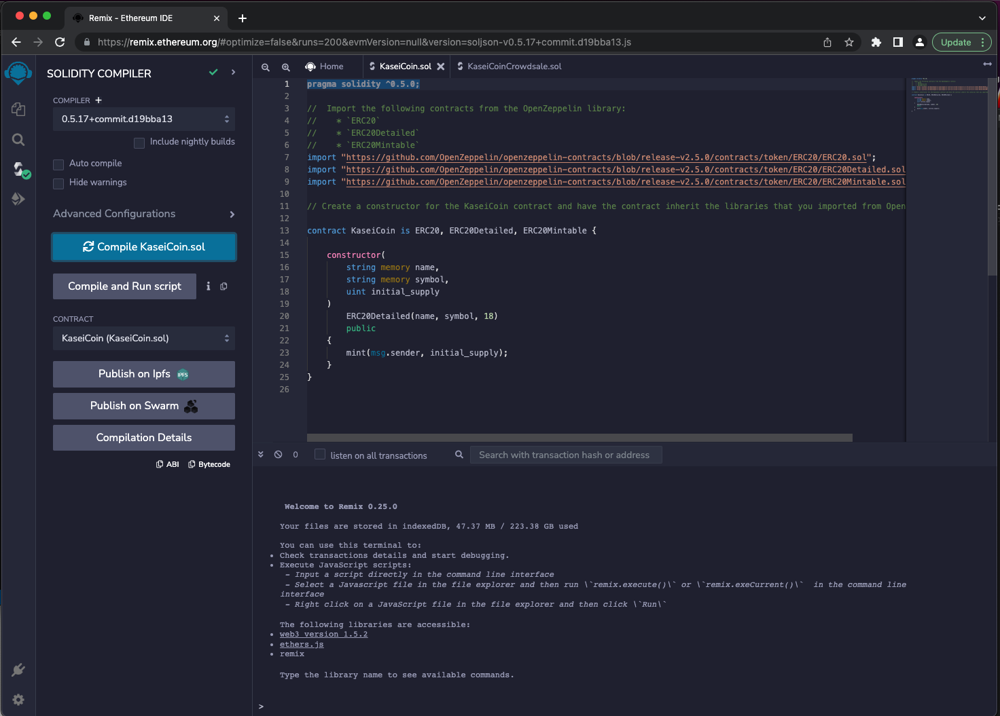
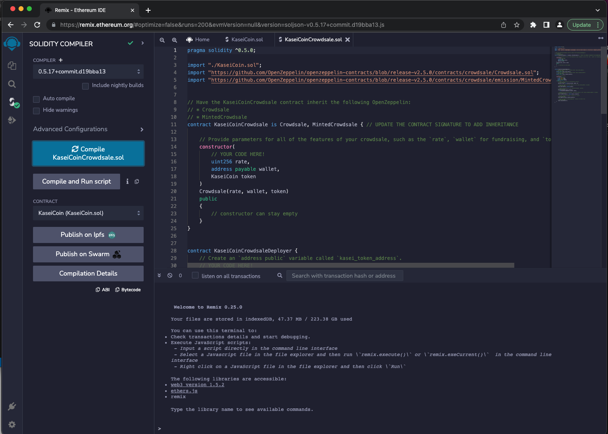
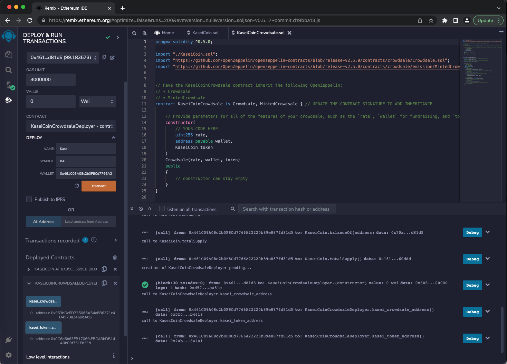
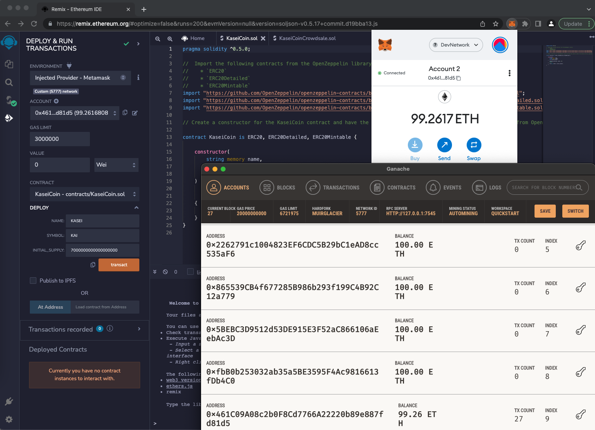
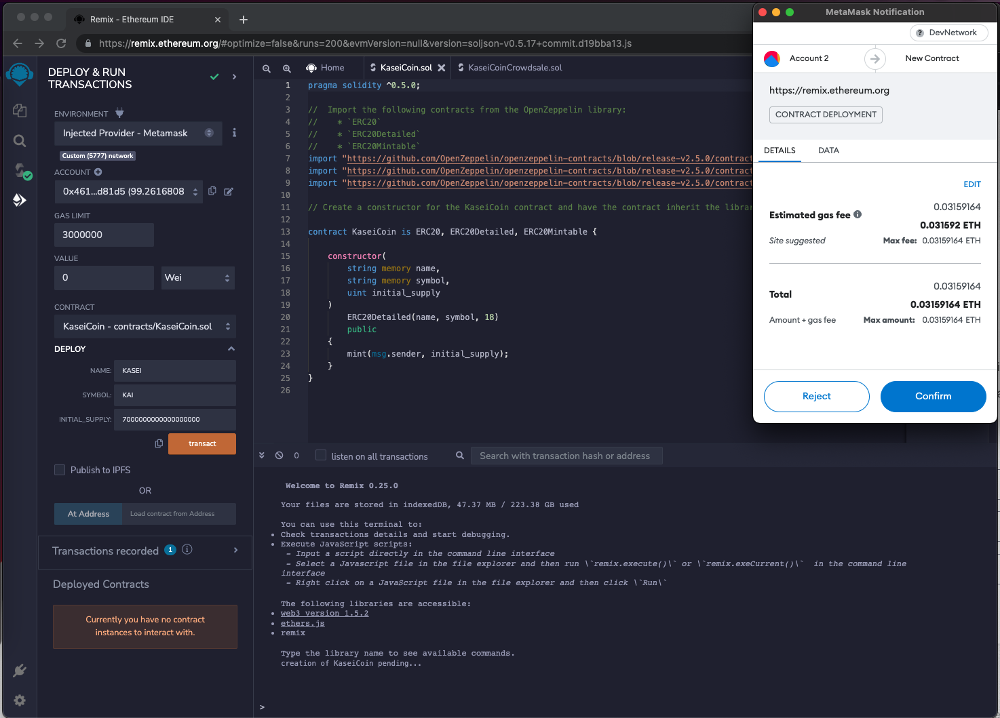
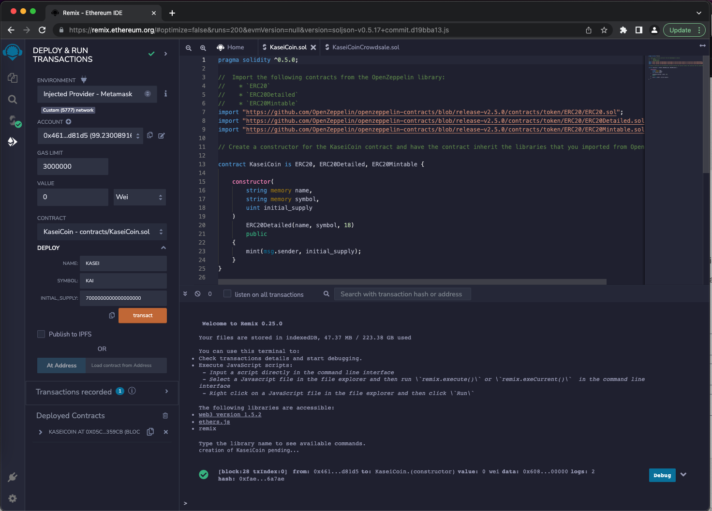
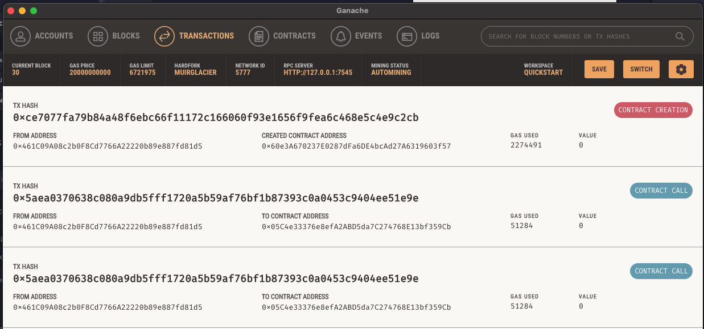

# Develop monetary system using blockchain technology.

The monetary system defines a new cryptocurrency named KasaiCoin which is a fungible token that is ERC-20 compliant. 
And includes a crowdsale launch to allow people to convert their earthling money to KaseiCoin.

The system includes:
a) KaseiCoin Token Contract
b) KaseiCoin Crowdsale Contract
c) KaseiCoin Deployer Contract

Here are the execution results:
#### **1. Successful Compilation of KaseiCoin Token Contract**   

  

#### **2. Compiled KaseiCoin Crowdsale Contract**   

  

#### **3. Compiled KaseiCoin Deployer Contract**   

  

#### **4. Account address and balance demonstration before Crowdsale Deployment**   

  

#### **5. Deploy the Crowdsale using Injected Provider - MetaMask**    

 

  
#### **6. Test the Crowdsale on a Local Blockchain**   
Created with initial supply of 7KAI at account address 0x461C09A08c2b0F8Cd7766A22220b89e887fd81d5 and after 2KAI transfer, the remaining balances display as uint256: 5000000000000000000 = 5KAI.

https://user-images.githubusercontent.com/99471693/181205078-250afb86-bcbd-4769-b70c-99cb62eb104b.mp4

  

#### **7. Ganache Transactions**   

